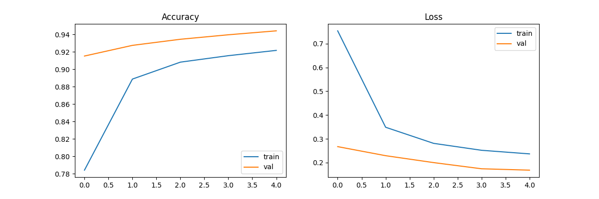
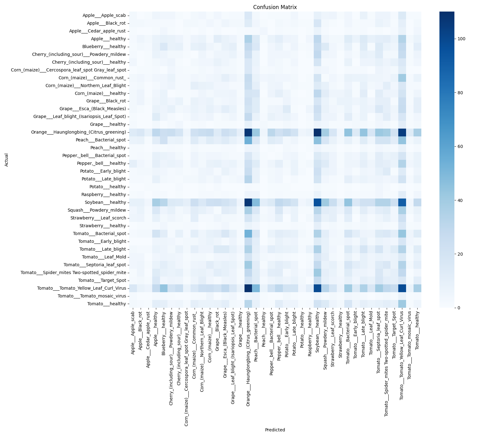

# 🌿 Plant Disease Classifier

A deep learning model that identifies plant diseases from leaf images using transfer learning (MobileNetV2). Built end-to-end: data preprocessing, model training, evaluation, and live deployment.

🔗 **Live Demo:** [Try it on Hugging Face Spaces](https://huggingface.co/spaces/swarajindap/plant-disease-classifier)

## Problem

Plant diseases cause significant crop loss worldwide. Early, accurate detection helps farmers act quickly. This project classifies leaf images into 38 categories (healthy or specific disease) across 14 crop species.

## Dataset

- **PlantVillage Dataset** (Kaggle) — ~54,000 images across 38 classes
- Source: [Kaggle - PlantVillage Dataset](https://www.kaggle.com/datasets/abdallahalidev/plantvillage-dataset)

## Approach

- **Base model:** MobileNetV2 (pretrained on ImageNet), used as a frozen feature extractor
- **Custom head:** GlobalAveragePooling → Dense(128, ReLU) → Dropout(0.3) → Dense(38, Softmax)
- **Data augmentation:** rotation, zoom, horizontal flip, width/height shift — to improve generalization
- **Training:** 5 epochs, Adam optimizer, categorical crossentropy loss

## Results

- **Train accuracy:** 92.2%
- **Validation accuracy:** 94.4%

### Training Curves

### Confusion Matrix

## Live Demo

The model is deployed with **Gradio** on **Hugging Face Spaces** — upload any leaf photo and get an instant disease prediction with confidence score.

👉 [https://huggingface.co/spaces/swarajindap/plant-disease-classifier](https://huggingface.co/spaces/swarajindap/plant-disease-classifier)

## Tech Stack

- Python, TensorFlow/Keras
- MobileNetV2 (transfer learning)
- Gradio (web app interface)
- Hugging Face Spaces (deployment)
- Google Colab (training, free GPU)

## Files

- `app.py` — Gradio app for inference
- `requirements.txt` — dependencies
- `training_curves.png` — accuracy/loss over training
- `confusion_matrix.png` — per-class performance

## Future Improvements

- Fine-tune deeper layers of MobileNetV2 for higher accuracy
- Add Grad-CAM visualization to show which leaf regions influenced the prediction
- Expand to more crop species and real-world (non-lab) images
- Build a mobile app version for field use

## Author

Swaraj Indap — AI/ML Engineering Student
